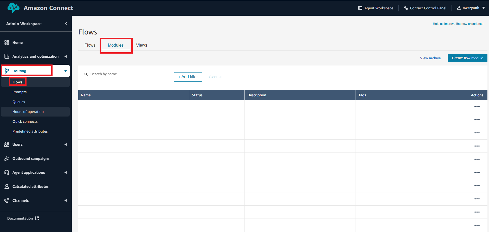
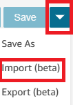
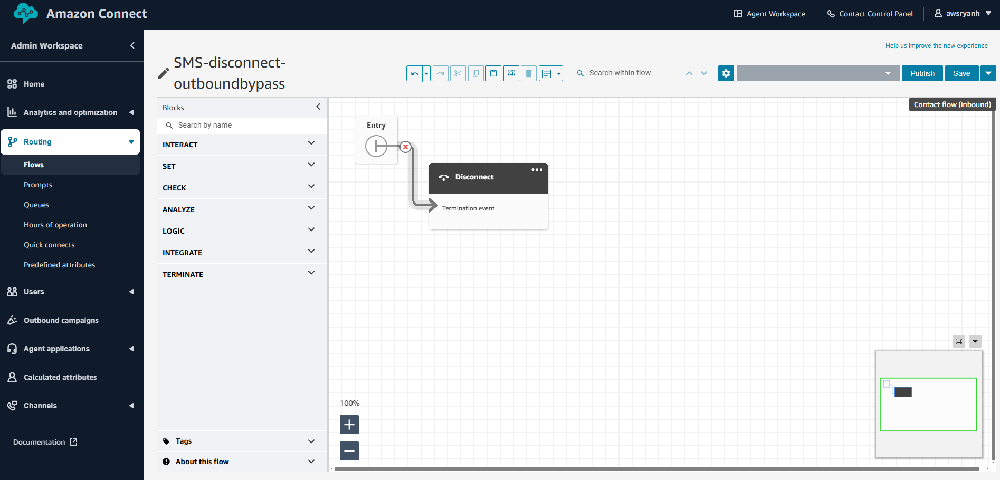

# OTP-Amazon-Connect-NO-Lambda
## How to send One Time Pin codes via SMS thru Amazon Connect without the use of AWS LAMBDA

### Summary
Sending a OTP (One Time Pin/Passcode) is a common 2 factor authentication method. Today within [Amazon Connect](https://aws.amazon.com/pm/connect/?gclid=CjwKCAjw-JG5BhBZEiwAt7JR61kHe_2bfC6TdZEZzdCgeykPLpGS8Pp4LshR5-8suR99TbcUUkYN0BoCZFwQAvD_BwE&trk=b2cc5159-9de2-4d31-97d8-b307ff66e724&sc_channel=ps&ef_id=CjwKCAjw-JG5BhBZEiwAt7JR61kHe_2bfC6TdZEZzdCgeykPLpGS8Pp4LshR5-8suR99TbcUUkYN0BoCZFwQAvD_BwE:G:s&s_kwcid=AL!4422!3!526836209702!e!!g!!amazon%20connect!13456873363!122860487989) most customer do this via an [AWS Lambda](https://aws.amazon.com/pm/lambda/?gclid=CjwKCAjw-JG5BhBZEiwAt7JR66KnCeUZlrSF6Ca_xBqgv1-w-IRWCYcTEn_v5j1zNTwcL81SQJV1nhoCcEkQAvD_BwE&trk=73f686c8-9606-40ad-852f-7b2bcafa68fe&sc_channel=ps&ef_id=CjwKCAjw-JG5BhBZEiwAt7JR66KnCeUZlrSF6Ca_xBqgv1-w-IRWCYcTEn_v5j1zNTwcL81SQJV1nhoCcEkQAvD_BwE:G:s&s_kwcid=AL!4422!3!651212652666!e!!g!!lambda!909122559!45462427876) call to handle to this process.
Not all Contact Center Admins / personal always have full access to the [AWS Management Console](https://aws.amazon.com/free/?gclid=CjwKCAjw-JG5BhBZEiwAt7JR659so8ZAPSlZZSmI2YgZQYL8gGbXYxqPKLMzM9xbe3d2Eu5tU2NZXxoCCmEQAvD_BwE&trk=78b916d7-7c94-4cab-98d9-0ce5e648dd5f&sc_channel=ps&ef_id=CjwKCAjw-JG5BhBZEiwAt7JR659so8ZAPSlZZSmI2YgZQYL8gGbXYxqPKLMzM9xbe3d2Eu5tU2NZXxoCCmEQAvD_BwE:G:s&s_kwcid=AL!4422!3!432339156168!e!!g!!aws%20console!9572385111!102212379247) and even using online examples of this code or deploying a solution via [CloudFormation](https://docs.aws.amazon.com/AWSCloudFormation/latest/UserGuide/Welcome.html) may not be easily possible.
This guide will walk you through Importing one [Amazon Connect Flow Module](https://docs.aws.amazon.com/connect/latest/adminguide/contact-flow-modules.html) and two [Amazon Connect Flows](https://docs.aws.amazon.com/connect/latest/adminguide/connect-contact-flows.html) and use zero Lambdas to complete this OTP process allowing you to fully deploy this solution in just the [Amazon Connect Admin Console](https://docs.aws.amazon.com/connect/latest/adminguide/what-is-amazon-connect.html).

### Assumptions
1. You have an Amazon Connect Instance with [Access](https://docs.aws.amazon.com/connect/latest/adminguide/connect-security-profiles.html) to publish Flows and map a phone number to test the solution.

### Deploying the solution
1. Download the [5digit-randomnumbergenerator-OTP.json](https://github.com/rhedlund87/OTP-Amazon-Connect-NO-Lambda/blob/main/5digit-randomnumbergenerator-OTP.json) Flow module.
2. Log into your Amazon Connect Instance and Naviagte to 'Routing', 'Flows' and then 'Modules' 
3. Click 'Create flow module' in the upper right hand corner
4. In the upper right hand corner click the blue down arrow and click 'Import (beta)' 
5. Click 'Choose File' and select the **5digit-randomnumbergenerator-OTP.json** downloaded in step 1
6. Click 'Import'
7. Click 'Save' and then click 'Publish'
8. Next download the [SMS-disconnect-outboundbypass.json](https://github.com/rhedlund87/OTP-Amazon-Connect-NO-Lambda/blob/main/SMS-disconnect-outboundbypass.json) Flow
9. Navigate back to 'Routing' and then 'Flows' and in the upper right hand corner click 'Create flow'
10. In the upper right hand corner click the blue down arrow and click 'Import (beta)'
11. Now, click 'Choose File' and select the **SMS-disconnect-outboundbypass.json** you just downloaded. 
12. Click 'Import'
13. You will notice this is just a disconnect, You wil be using the [Send Message](https://docs.aws.amazon.com/connect/latest/adminguide/send-message.html) Block in the **Test-OTP** flow which requires you to set a Flow. This is helpful as it can handle the outbound contact created. This flow can be used to assign the outbound contact to an agent to respond to the customer. But we don't need the customer to respond and only want this to be an outbound message with the OTP.
14. Now, click 'Save' and then click 'Publish'
15. Download the third and final flow [Test-OTP.json](https://github.com/rhedlund87/OTP-Amazon-Connect-NO-Lambda/blob/main/Test-OTP.json)
16. Ok, navigate back to 'Routing' and then 'Flows' and in the upper right hand corner click 'Create flow'
17. Again, in the upper right hand corner click the blue down arrow and click 'Import (beta)'
18. Click 'Choose File' and select the **Test-OTP.json** you just downloaded.
19. Click 'Import'

*NOTE* Currently it the Send Message block does not import with the flow. Two send message blocks need to be added to the flow after Set COntact Attrobutes for SMSPIN varibale and After the Complete output form the Loop step.  

### Testing the Solution
